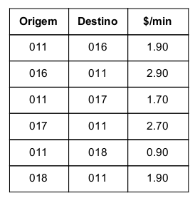
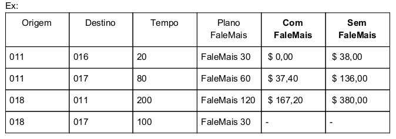

# Disk Mais - TELEFIC
Solução desenvolvida para a seleção em uma vaga de emprego.

## Proposta
A empresa de telefonia TELEFIC, especializada em chamadas de longa distância nacional, vai
colocar um novo produto no mercado chamado DiskMais.
Normalmente um cliente TELEFIC pode fazer uma chamada de uma cidade para outra pagando
uma tarifa fixa por minuto, com o preço sendo pré-definido em uma lista com os códigos DDDs
de origem e destino:

## Desafio
Com o novo produto DiskMais da TELEFIC o cliente adquire um plano e pode falar de graça até
um determinado tempo (em minutos) e só paga os minutos excedentes. Os minutos
excedentes tem um acréscimo de 10% sobre a tarifa normal do minuto. Os planos são
DiskMais 30 (30 minutos), DiskMais 60 (60 minutos) e DiskMais 120 (120 minutos).
A TELEFIC, preocupada com a transparência junto aos seus clientes, quer disponibilizar uma
página na web onde o cliente pode calcular o valor da ligação. Ali, o cliente pode escolher os
códigos das cidades de origem e destino, o tempo da ligação em minutos e escolher qual o
plano DiskMais. O sistema deve mostrar dois valores: (1) o valor da ligação com o plano e (2)
sem o plano. O custo inicial de aquisição do plano deve ser desconsiderado para este
problema.

